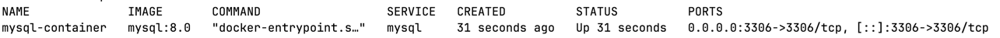
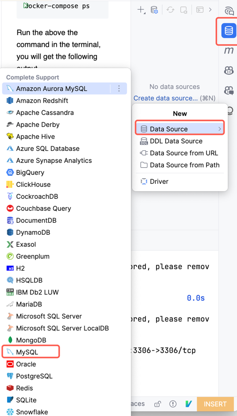
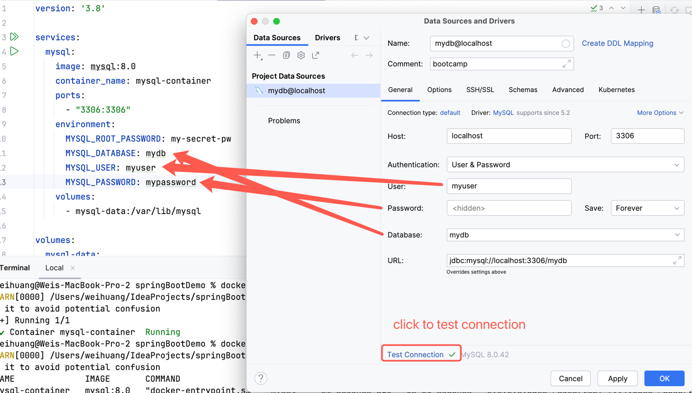

## docker install

### Download and install Docker based on your operating system
> https://www.docker.com/

### Create a docker-compose.yml file
``` yaml
version: '3.8'

services:
  mysql:
    image: mysql:8.0
    container_name: mysql-container
    ports:
      - "3306:3306"
    environment:
      MYSQL_ROOT_PASSWORD: my-secret-pw
      MYSQL_DATABASE: mydb
      MYSQL_USER: myuser
      MYSQL_PASSWORD: mypassword
    volumes:
      - mysql-data:/var/lib/mysql

volumes:
  mysql-data:
```
> It will take some time to pull image to you local, please keep patience.

### Run the MySQL service in the terminal
```shell
docker-compose up -d
```

### Verify
``` shell
docker-compose ps
```
Run the above the command in the terminal, you will get the following output.
[]()

### Connect to MySQL
- **Option1:** use IDE plugin to connect to MySQL, example with Intellij



- **Option2:** Use workbench, refer to the following link:
https://www.mysql.com/products/workbench/

